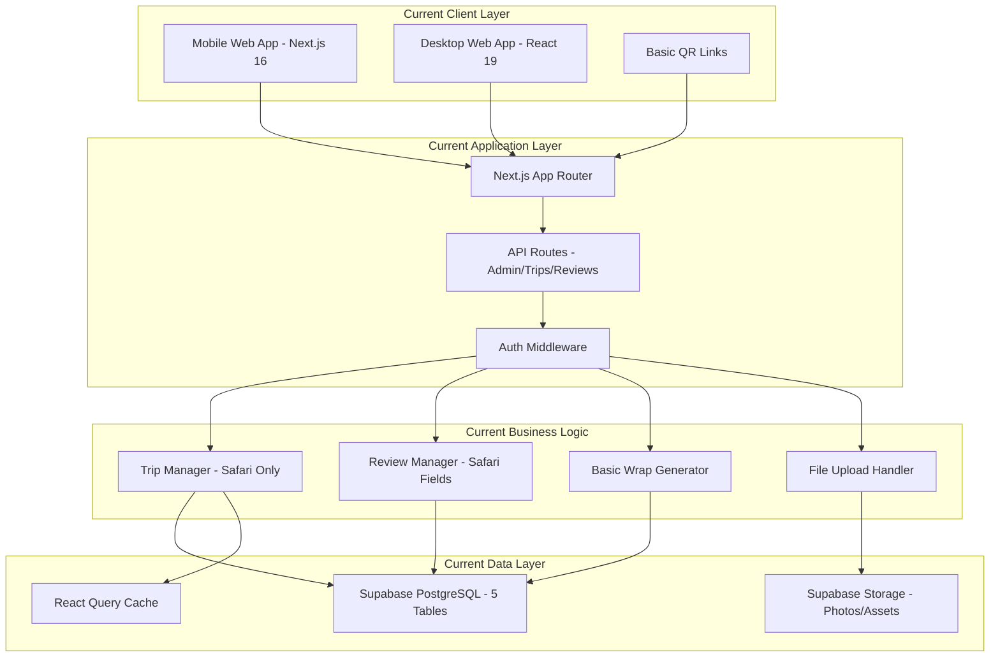
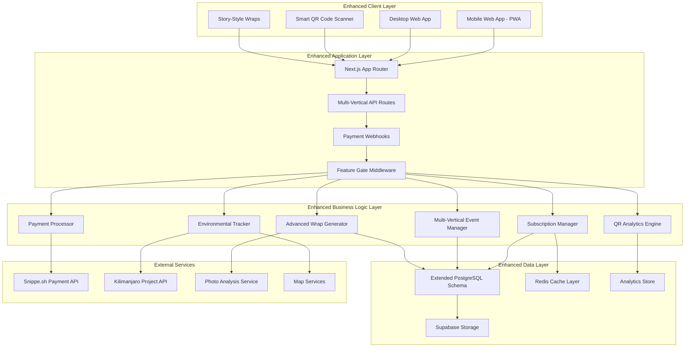
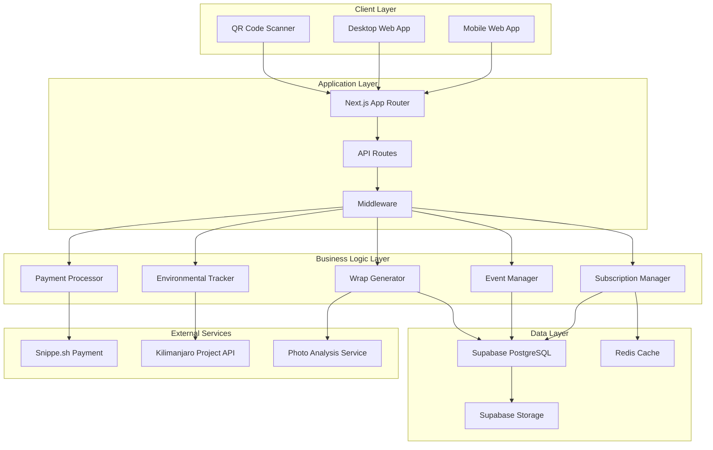
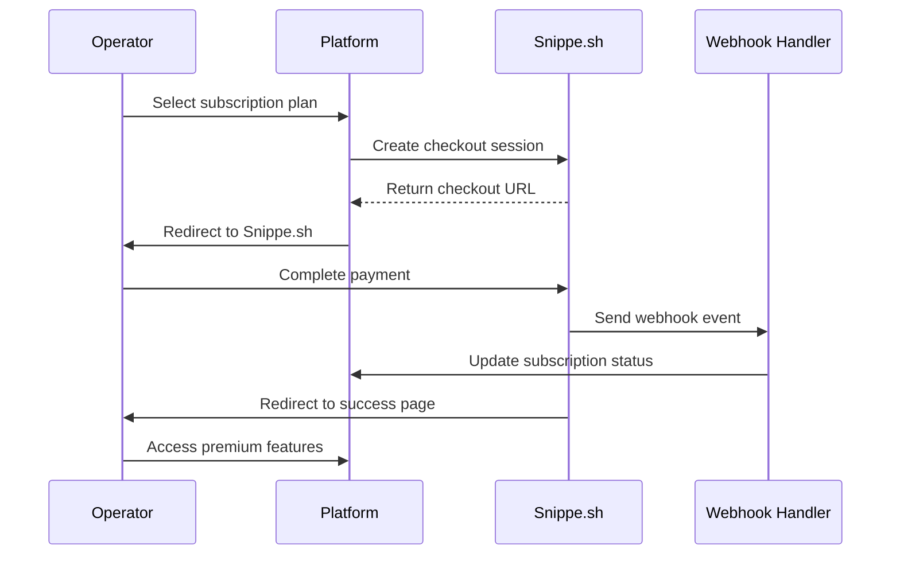
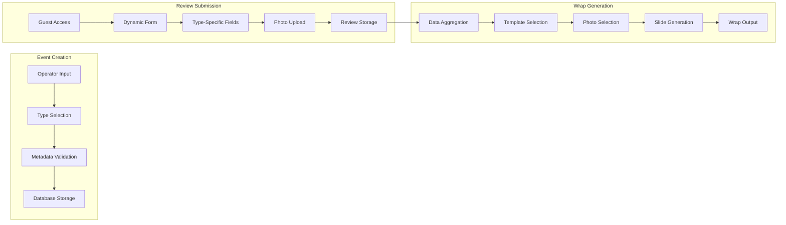

# Design Document: Payment and Platform Features

## Overview

This design document outlines the architecture for transforming SafariWrap from a safari-focused MVP into a comprehensive Experience Intelligence Platform. The design encompasses payment integration with Snippe.sh, multi-vertical support (safaris, marathons, tours), environmental impact tracking, advanced wrap generation, and enhanced QR code functionality.

The platform will support three subscription tiers (Free, Pro, Enterprise) with feature gating, real-time payment webhook processing, and dynamic content generation based on experience type. Environmental impact tracking includes tree planting allocation, GPS location tracking, and impact certificate generation.

## Current State Architecture

### Existing System Overview

SafariWrap currently operates as a functional safari-focused platform built on modern web technologies:



### Current Database Schema

The existing schema supports safari operations with 5 core tables:

```sql
-- Current operators table (0 records)
CREATE TABLE operators (
  id UUID PRIMARY KEY REFERENCES auth.users(id),
  name TEXT NOT NULL,
  business_name TEXT NOT NULL,
  email TEXT UNIQUE NOT NULL,
  logo_url TEXT,
  brand_color_1 TEXT DEFAULT '#1B4D3E',
  brand_color_2 TEXT DEFAULT '#F4C542',
  created_at TIMESTAMPTZ DEFAULT NOW()
);

-- Current destinations table (10 pre-seeded records)
CREATE TABLE destinations (
  id UUID PRIMARY KEY DEFAULT uuid_generate_v4(),
  name TEXT NOT NULL,
  country TEXT DEFAULT 'Tanzania',
  fun_fact TEXT,
  area TEXT,
  wildlife_highlight TEXT,
  emoji TEXT DEFAULT '🌍',
  created_at TIMESTAMPTZ DEFAULT NOW()
);

-- Current trips table (safari-only, 0 records)
CREATE TABLE trips (
  id UUID PRIMARY KEY DEFAULT uuid_generate_v4(),
  trip_name TEXT NOT NULL,
  start_date DATE NOT NULL,
  end_date DATE NOT NULL,
  status TEXT DEFAULT 'Upcoming' CHECK (status IN ('Upcoming', 'Completed')),
  review_link TEXT,
  operator_id UUID REFERENCES operators(id),
  destination_ids UUID[] DEFAULT '{}',
  destination_names TEXT[] DEFAULT '{}',
  created_at TIMESTAMPTZ DEFAULT NOW()
);

-- Current reviews table (safari-specific fields, 0 records)
CREATE TABLE reviews (
  id UUID PRIMARY KEY DEFAULT uuid_generate_v4(),
  guest_name TEXT NOT NULL,
  email TEXT,
  star_rating INTEGER CHECK (star_rating >= 1 AND star_rating <= 5),
  review_text TEXT,
  photo_1_url TEXT,
  photo_2_url TEXT,
  photo_3_url TEXT,
  safari_duration TEXT,
  big_five_seen TEXT DEFAULT '',
  other_animals TEXT DEFAULT '',
  best_time TEXT,
  memorable_moment TEXT,
  data_consent BOOLEAN DEFAULT FALSE,
  marketing_consent BOOLEAN DEFAULT FALSE,
  trip_id UUID REFERENCES trips(id),
  created_at TIMESTAMPTZ DEFAULT NOW()
);

-- Current safari_wraps table (basic wraps, 0 records)
CREATE TABLE safari_wraps (
  id UUID PRIMARY KEY DEFAULT uuid_generate_v4(),
  guest_name TEXT NOT NULL,
  wrap_url TEXT,
  tree_gps TEXT DEFAULT '-3.3869, 37.3466',
  review_id UUID REFERENCES reviews(id),
  trip_id UUID REFERENCES trips(id),
  created_at TIMESTAMPTZ DEFAULT NOW()
);
```

### Current API Implementation

The platform currently provides these API endpoints:

```typescript
// Current API structure
/api/admin/
  ├── trips/route.ts          // GET: List all trips with review counts
  ├── reviews/route.ts        // GET: List all reviews with trip info
  ├── operators/route.ts      // GET/POST: Operator management
  ├── stats/route.ts          // GET: Dashboard statistics
  └── utils.ts               // Admin auth helpers

// Current client API (lib/api/)
tripsApi: {
  getOperatorTrips(operatorId)    // Safari trips only
  getTripById(tripId)             // With operator details
  createTrip(tripData)            // Safari-specific creation
  markTripComplete(tripId)        // Status update
}

reviewsApi: {
  getTripReviews(tripId)          // Safari reviews with animal sightings
  createReview(reviewData)        // Safari-specific fields
  uploadReviewPhoto(file, reviewId, index) // Supabase Storage
}
```

### Current UI Components

The platform includes these implemented components:

```typescript
// Authentication & Layout
AuthContext                     // User/operator state management
Layout components              // Admin and authenticated layouts
Middleware                     // Route protection and role-based access

// Dashboard & Management
DashboardPage                  // Operator stats and trip overview
CreateTripPage                 // Safari trip creation form
TripCard                       // Trip display with review counts
StatCard                       // Dashboard metrics display

// UI System
SafariButton                   // Themed button component
SafariTextField                // Themed input component
LoadingOverlay                 // Loading states
```

### Current Limitations

1. **Safari-Only Schema**: trips table with destination arrays, no multi-vertical support
2. **No Payment System**: No subscription management, feature gating, or monetization
3. **Basic Wraps**: Simple generation without animations or story navigation
4. **Limited QR Codes**: Basic review links without analytics or branding
5. **No Environmental Tracking**: No tree planting, GPS, or impact certificates
6. **Single Vertical**: Only safari experiences supported

## Target Architecture

### Enhanced System Architecture



### Migration Path from Current to Target

#### Phase 1: Database Schema Extension (Backward Compatible)
```sql
-- Add subscription tables (new)
CREATE TABLE subscriptions (
  id UUID PRIMARY KEY DEFAULT uuid_generate_v4(),
  operator_id UUID REFERENCES operators(id),
  plan TEXT CHECK (plan IN ('free', 'pro', 'enterprise')) DEFAULT 'free',
  status TEXT CHECK (status IN ('active', 'cancelled', 'expired', 'trialing')) DEFAULT 'active',
  expires_at TIMESTAMPTZ,
  snippesh_subscription_id TEXT UNIQUE,
  snippesh_customer_id TEXT,
  created_at TIMESTAMPTZ DEFAULT NOW(),
  updated_at TIMESTAMPTZ DEFAULT NOW()
);

-- Add payment tracking (new)
CREATE TABLE payments (
  id UUID PRIMARY KEY DEFAULT uuid_generate_v4(),
  operator_id UUID REFERENCES operators(id),
  subscription_id UUID REFERENCES subscriptions(id),
  amount DECIMAL(10, 2) NOT NULL,
  currency TEXT DEFAULT 'USD',
  status TEXT CHECK (status IN ('pending', 'completed', 'failed', 'refunded')),
  provider TEXT DEFAULT 'snippesh',
  transaction_id TEXT UNIQUE,
  metadata JSONB,
  created_at TIMESTAMPTZ DEFAULT NOW()
);

-- Create events table (multi-vertical replacement for trips)
CREATE TABLE events (
  id UUID PRIMARY KEY DEFAULT uuid_generate_v4(),
  operator_id UUID REFERENCES operators(id),
  type TEXT CHECK (type IN ('safari', 'marathon', 'tour')) NOT NULL,
  title TEXT NOT NULL,
  location TEXT NOT NULL,
  start_date DATE NOT NULL,
  end_date DATE NOT NULL,
  status TEXT DEFAULT 'upcoming' CHECK (status IN ('upcoming', 'active', 'completed', 'cancelled')),
  metadata JSONB DEFAULT '{}',
  review_link TEXT,
  created_at TIMESTAMPTZ DEFAULT NOW(),
  updated_at TIMESTAMPTZ DEFAULT NOW()
);

-- Migrate existing trips to events
INSERT INTO events (id, operator_id, type, title, location, start_date, end_date, status, metadata, review_link, created_at)
SELECT 
  id,
  operator_id,
  'safari' as type,
  trip_name as title,
  COALESCE(destination_names[1], 'Safari Location') as location,
  start_date,
  end_date,
  LOWER(status) as status,
  jsonb_build_object(
    'destination_ids', destination_ids,
    'destination_names', destination_names
  ) as metadata,
  review_link,
  created_at
FROM trips;

-- Add environmental impact tables (new)
CREATE TABLE tree_activities (
  id UUID PRIMARY KEY DEFAULT uuid_generate_v4(),
  event_id UUID REFERENCES events(id),
  trees_planted INTEGER CHECK (trees_planted > 0),
  planting_date DATE DEFAULT CURRENT_DATE,
  co2_offset_kg DECIMAL(10, 2) GENERATED ALWAYS AS (trees_planted * 22) STORED,
  certificate_url TEXT,
  created_at TIMESTAMPTZ DEFAULT NOW()
);

CREATE TABLE gps_locations (
  id UUID PRIMARY KEY DEFAULT uuid_generate_v4(),
  tree_activity_id UUID REFERENCES tree_activities(id),
  latitude DECIMAL(10, 8) CHECK (latitude >= -90 AND latitude <= 90),
  longitude DECIMAL(11, 8) CHECK (longitude >= -180 AND longitude <= 180),
  location_name TEXT NOT NULL,
  verified BOOLEAN DEFAULT FALSE,
  created_at TIMESTAMPTZ DEFAULT NOW()
);

-- Add QR code analytics (new)
CREATE TABLE qr_codes (
  id UUID PRIMARY KEY DEFAULT uuid_generate_v4(),
  event_id UUID REFERENCES events(id),
  short_code TEXT UNIQUE NOT NULL,
  code_url TEXT NOT NULL,
  scans_count INTEGER DEFAULT 0,
  unique_scans_count INTEGER DEFAULT 0,
  created_at TIMESTAMPTZ DEFAULT NOW()
);

CREATE TABLE qr_code_scans (
  id UUID PRIMARY KEY DEFAULT uuid_generate_v4(),
  qr_code_id UUID REFERENCES qr_codes(id),
  ip_address INET,
  user_agent TEXT,
  location_country TEXT,
  location_city TEXT,
  converted_to_review BOOLEAN DEFAULT FALSE,
  scanned_at TIMESTAMPTZ DEFAULT NOW()
);

-- Extend reviews for multi-vertical (add metadata column)
ALTER TABLE reviews ADD COLUMN metadata JSONB DEFAULT '{}';

-- Migrate existing safari-specific fields to metadata
UPDATE reviews SET metadata = jsonb_build_object(
  'safari_duration', safari_duration,
  'big_five_seen', big_five_seen,
  'other_animals', other_animals,
  'best_time', best_time,
  'memorable_moment', memorable_moment
) WHERE safari_duration IS NOT NULL OR big_five_seen IS NOT NULL;
```

#### Phase 2: API Extension (Backward Compatible)
```typescript
// Extended API structure maintaining backward compatibility
/api/
├── subscriptions/
│   ├── create-checkout/route.ts    // Snippe.sh checkout creation
│   ├── portal/route.ts             // Customer portal access
│   └── status/route.ts             // Current subscription info
├── webhooks/
│   └── snippesh/route.ts           // Payment webhook handler
├── events/                         // Multi-vertical event management
│   ├── route.ts                    // GET/POST events
│   └── [eventId]/
│       ├── route.ts                // GET/PUT/DELETE specific event
│       └── qr-code/route.ts        // QR code generation
├── reviews/
│   ├── form/[eventId]/route.ts     // Dynamic form based on event type
│   └── route.ts                    // Enhanced review submission
├── wraps/
│   ├── [id]/route.ts               // Enhanced wrap data
│   ├── [id]/regenerate/route.ts    // Wrap regeneration
│   └── [id]/og-image/route.ts      // OG image generation
├── environmental/
│   ├── impact/[operatorId]/route.ts // Impact metrics
│   ├── certificate/[reviewId]/route.ts // Certificate generation
│   └── map/route.ts                // Tree location map data
└── admin/                          // Enhanced admin endpoints
    ├── trips/route.ts              // Backward compatibility
    └── events/route.ts             // New multi-vertical management
```

#### Phase 3: UI Component Enhancement
```typescript
// Enhanced component structure
components/
├── subscription/
│   ├── PricingPage.tsx             // Plan selection and comparison
│   ├── SubscriptionBadge.tsx       // Current plan display
│   ├── UpgradePrompt.tsx           // Feature limit notifications
│   └── FeatureGate.tsx             // Conditional feature access
├── events/
│   ├── CreateEventPage.tsx         // Multi-vertical event creation
│   ├── SafariEventForm.tsx         // Safari-specific fields
│   ├── MarathonEventForm.tsx       // Marathon-specific fields
│   └── TourEventForm.tsx           // Tour-specific fields
├── wraps/
│   ├── StoryWrapViewer.tsx         // Story-style navigation
│   ├── SwipeGestureHandler.tsx     // Mobile swipe support
│   ├── SlideComponents/            // Individual slide types
│   │   ├── IntroSlide.tsx
│   │   ├── StatsSlide.tsx
│   │   ├── PhotoGallerySlide.tsx
│   │   ├── EnvironmentalSlide.tsx
│   │   └── SharingSlide.tsx
│   └── AnimationProvider.tsx       // Framer Motion animations
├── environmental/
│   ├── ImpactDashboard.tsx         // Environmental metrics
│   ├── TreeMap.tsx                 // Interactive tree location map
│   └── ImpactCertificate.tsx       // Certificate generation
└── qr/
    ├── QRCodeGenerator.tsx         // Branded QR code creation
    ├── QRAnalytics.tsx             // Scan tracking and metrics
    └── PrintTemplates.tsx          // Print-ready QR materials
```

This design provides a comprehensive migration path from the current safari-only MVP to a full multi-vertical Experience Intelligence Platform while maintaining backward compatibility and data integrity throughout the transition.

## Architecture

### High-Level System Architecture



### Payment Integration Architecture



### Multi-Vertical Data Flow



## Components and Interfaces

### Core Components

#### 1. Subscription Manager
```typescript
interface SubscriptionManager {
  createCheckoutSession(plan: SubscriptionPlan, operatorId: string): Promise<CheckoutSession>
  processWebhook(event: WebhookEvent): Promise<void>
  checkFeatureAccess(operatorId: string, feature: Feature): Promise<boolean>
  syncSubscriptionStatus(operatorId: string): Promise<Subscription>
  generateCustomerPortalUrl(customerId: string): Promise<string>
}
```

#### 2. Event Manager
```typescript
interface EventManager {
  createEvent(event: CreateEventRequest): Promise<Event>
  validateMetadata(type: EventType, metadata: unknown): ValidationResult
  migrateTripsToEvents(): Promise<MigrationResult>
  getEventsByOperator(operatorId: string): Promise<Event[]>
  generateQRCode(eventId: string): Promise<QRCode>
}
```

#### 3. Wrap Generator
```typescript
interface WrapGenerator {
  generateWrap(reviewId: string): Promise<Wrap>
  selectPhotos(photos: Photo[]): Promise<Photo[]>
  createSlides(event: Event, review: Review): Promise<Slide[]>
  generateOGImage(wrap: Wrap): Promise<string>
  applyAnimations(slides: Slide[]): Promise<AnimatedSlide[]>
}
```

#### 4. Environmental Tracker
```typescript
interface EnvironmentalTracker {
  allocateTrees(eventId: string, reviewCount: number): Promise<TreeActivity>
  assignGPSLocation(treeActivityId: string): Promise<GPSLocation>
  generateImpactCertificate(guestName: string, treeActivity: TreeActivity): Promise<Certificate>
  calculateCarbonOffset(treesPlanted: number): number
  getImpactMetrics(operatorId: string): Promise<ImpactMetrics>
}
```

### API Endpoints

#### Payment Endpoints
- `POST /api/subscriptions/create-checkout` - Create Snippe.sh checkout session
- `POST /api/subscriptions/portal` - Generate customer portal URL
- `POST /api/webhooks/snippesh` - Process payment webhooks
- `GET /api/subscriptions/status` - Get current subscription status

#### Event Management Endpoints
- `POST /api/events` - Create new event (multi-vertical)
- `GET /api/events` - List operator's events
- `PUT /api/events/:id` - Update event
- `DELETE /api/events/:id` - Delete event
- `POST /api/events/:id/qr-code` - Generate QR code

#### Review Endpoints
- `GET /api/reviews/form/:eventId` - Get dynamic review form
- `POST /api/reviews` - Submit review
- `GET /api/reviews/:eventId` - Get event reviews

#### Wrap Endpoints
- `GET /api/wraps/:id` - Get wrap data
- `POST /api/wraps/:id/regenerate` - Regenerate wrap
- `GET /api/wraps/:id/og-image` - Get Open Graph image

#### Environmental Endpoints
- `GET /api/environmental/impact/:operatorId` - Get impact metrics
- `POST /api/environmental/certificate/:reviewId` - Generate certificate
- `GET /api/environmental/map` - Get tree planting locations

### UI Components

#### Dynamic Form Components
```typescript
interface DynamicFormProps {
  eventType: EventType
  eventId: string
  onSubmit: (data: ReviewData) => void
}

// Type-specific form components
const SafariReviewForm: React.FC<SafariFormProps>
const MarathonReviewForm: React.FC<MarathonFormProps>
const TourReviewForm: React.FC<TourFormProps>
```

#### Wrap Slide Components
```typescript
interface SlideProps {
  data: SlideData
  index: number
  isActive: boolean
  onNext: () => void
  onPrevious: () => void
}

const IntroSlide: React.FC<SlideProps>
const StatsSlide: React.FC<SlideProps>
const PhotoGallerySlide: React.FC<SlideProps>
const EnvironmentalImpactSlide: React.FC<SlideProps>
const SharingSlide: React.FC<SlideProps>
```

#### Feature Gate Components
```typescript
interface FeatureGateProps {
  feature: Feature
  fallback?: React.ReactNode
  children: React.ReactNode
}

const FeatureGate: React.FC<FeatureGateProps>
const UpgradePrompt: React.FC<UpgradePromptProps>
```

## Data Models

### Extended Database Schema

#### Subscription Tables
```sql
-- Subscriptions table
CREATE TABLE subscriptions (
  id UUID PRIMARY KEY DEFAULT uuid_generate_v4(),
  operator_id UUID NOT NULL REFERENCES operators(id) ON DELETE CASCADE,
  plan TEXT NOT NULL CHECK (plan IN ('free', 'pro', 'enterprise')),
  status TEXT NOT NULL CHECK (status IN ('active', 'cancelled', 'expired', 'trialing')),
  expires_at TIMESTAMPTZ,
  snippesh_subscription_id TEXT UNIQUE,
  snippesh_customer_id TEXT,
  created_at TIMESTAMPTZ NOT NULL DEFAULT NOW(),
  updated_at TIMESTAMPTZ NOT NULL DEFAULT NOW()
);

-- Payments table
CREATE TABLE payments (
  id UUID PRIMARY KEY DEFAULT uuid_generate_v4(),
  operator_id UUID NOT NULL REFERENCES operators(id) ON DELETE CASCADE,
  subscription_id UUID REFERENCES subscriptions(id),
  amount DECIMAL(10, 2) NOT NULL,
  currency TEXT NOT NULL DEFAULT 'USD',
  status TEXT NOT NULL CHECK (status IN ('pending', 'completed', 'failed', 'refunded')),
  provider TEXT NOT NULL DEFAULT 'snippesh',
  transaction_id TEXT UNIQUE,
  metadata JSONB,
  created_at TIMESTAMPTZ NOT NULL DEFAULT NOW()
);
```

#### Multi-Vertical Tables
```sql
-- Events table (replaces trips)
CREATE TABLE events (
  id UUID PRIMARY KEY DEFAULT uuid_generate_v4(),
  operator_id UUID NOT NULL REFERENCES operators(id) ON DELETE CASCADE,
  type TEXT NOT NULL CHECK (type IN ('safari', 'marathon', 'tour')),
  title TEXT NOT NULL,
  location TEXT NOT NULL,
  start_date DATE NOT NULL,
  end_date DATE NOT NULL,
  status TEXT NOT NULL DEFAULT 'upcoming' CHECK (status IN ('upcoming', 'active', 'completed', 'cancelled')),
  metadata JSONB NOT NULL DEFAULT '{}',
  review_link TEXT,
  created_at TIMESTAMPTZ NOT NULL DEFAULT NOW(),
  updated_at TIMESTAMPTZ NOT NULL DEFAULT NOW()
);

-- QR Codes table
CREATE TABLE qr_codes (
  id UUID PRIMARY KEY DEFAULT uuid_generate_v4(),
  event_id UUID NOT NULL REFERENCES events(id) ON DELETE CASCADE,
  short_code TEXT NOT NULL UNIQUE,
  code_url TEXT NOT NULL,
  scans_count INTEGER NOT NULL DEFAULT 0,
  unique_scans_count INTEGER NOT NULL DEFAULT 0,
  created_at TIMESTAMPTZ NOT NULL DEFAULT NOW()
);

-- QR Code Analytics table
CREATE TABLE qr_code_scans (
  id UUID PRIMARY KEY DEFAULT uuid_generate_v4(),
  qr_code_id UUID NOT NULL REFERENCES qr_codes(id) ON DELETE CASCADE,
  ip_address INET,
  user_agent TEXT,
  location_country TEXT,
  location_city TEXT,
  converted_to_review BOOLEAN DEFAULT FALSE,
  scanned_at TIMESTAMPTZ NOT NULL DEFAULT NOW()
);
```

#### Environmental Impact Tables
```sql
-- Tree Activities table
CREATE TABLE tree_activities (
  id UUID PRIMARY KEY DEFAULT uuid_generate_v4(),
  event_id UUID NOT NULL REFERENCES events(id) ON DELETE CASCADE,
  trees_planted INTEGER NOT NULL CHECK (trees_planted > 0),
  planting_date DATE NOT NULL DEFAULT CURRENT_DATE,
  co2_offset_kg DECIMAL(10, 2) GENERATED ALWAYS AS (trees_planted * 22) STORED,
  certificate_url TEXT,
  created_at TIMESTAMPTZ NOT NULL DEFAULT NOW()
);

-- GPS Locations table
CREATE TABLE gps_locations (
  id UUID PRIMARY KEY DEFAULT uuid_generate_v4(),
  tree_activity_id UUID NOT NULL REFERENCES tree_activities(id) ON DELETE CASCADE,
  latitude DECIMAL(10, 8) NOT NULL CHECK (latitude >= -90 AND latitude <= 90),
  longitude DECIMAL(11, 8) NOT NULL CHECK (longitude >= -180 AND longitude <= 180),
  location_name TEXT NOT NULL,
  verified BOOLEAN NOT NULL DEFAULT FALSE,
  created_at TIMESTAMPTZ NOT NULL DEFAULT NOW()
);
```

### TypeScript Type Definitions

#### Event Types
```typescript
type EventType = 'safari' | 'marathon' | 'tour'

interface BaseEvent {
  id: string
  operator_id: string
  type: EventType
  title: string
  location: string
  start_date: string
  end_date: string
  status: 'upcoming' | 'active' | 'completed' | 'cancelled'
  review_link: string | null
  created_at: string
  updated_at: string
}

interface SafariEvent extends BaseEvent {
  type: 'safari'
  metadata: {
    destination_ids: string[]
    destination_names: string[]
    duration_days?: number
    group_size?: number
  }
}

interface MarathonEvent extends BaseEvent {
  type: 'marathon'
  metadata: {
    distance: number
    start_location: string
    route_map_url?: string
    elevation_gain?: number
    time_limit?: number
  }
}

interface TourEvent extends BaseEvent {
  type: 'tour'
  metadata: {
    locations: string[]
    tour_type: 'cultural' | 'historical' | 'adventure' | 'culinary'
    duration_hours?: number
    max_participants?: number
  }
}

type Event = SafariEvent | MarathonEvent | TourEvent
```

#### Subscription Types
```typescript
type SubscriptionPlan = 'free' | 'pro' | 'enterprise'
type SubscriptionStatus = 'active' | 'cancelled' | 'expired' | 'trialing'

interface Subscription {
  id: string
  operator_id: string
  plan: SubscriptionPlan
  status: SubscriptionStatus
  expires_at: string | null
  snippesh_subscription_id: string | null
  snippesh_customer_id: string | null
  created_at: string
  updated_at: string
}

interface Payment {
  id: string
  operator_id: string
  subscription_id: string | null
  amount: number
  currency: string
  status: 'pending' | 'completed' | 'failed' | 'refunded'
  provider: string
  transaction_id: string | null
  metadata: Record<string, any>
  created_at: string
}
```

#### Environmental Types
```typescript
interface TreeActivity {
  id: string
  event_id: string
  trees_planted: number
  planting_date: string
  co2_offset_kg: number
  certificate_url: string | null
  created_at: string
}

interface GPSLocation {
  id: string
  tree_activity_id: string
  latitude: number
  longitude: number
  location_name: string
  verified: boolean
  created_at: string
}

interface ImpactMetrics {
  total_trees_planted: number
  total_co2_offset_kg: number
  certificates_generated: number
  events_with_impact: number
  monthly_tree_data: Array<{
    month: string
    trees_planted: number
  }>
}
```

## Migration Strategy from Trips to Events

### Phase 1: Schema Extension
1. Create new `events` table with multi-vertical support
2. Add `type` column with default 'safari'
3. Add `metadata` JSONB column for type-specific data
4. Create indexes for performance

### Phase 2: Data Migration
```sql
-- Migration script
INSERT INTO events (
  id, operator_id, type, title, location, start_date, end_date, status, metadata, review_link, created_at
)
SELECT 
  id,
  operator_id,
  'safari' as type,
  trip_name as title,
  COALESCE(destination_names[1], 'Safari Location') as location,
  start_date,
  end_date,
  LOWER(status) as status,
  jsonb_build_object(
    'destination_ids', destination_ids,
    'destination_names', destination_names
  ) as metadata,
  review_link,
  created_at
FROM trips;
```

### Phase 3: Foreign Key Updates
1. Update `reviews` table to reference `events` instead of `trips`
2. Update `safari_wraps` table references
3. Create migration for existing data integrity

### Phase 4: Application Code Updates
1. Update API endpoints to use `events` table
2. Modify UI components to handle event types
3. Update database queries and ORM models
4. Test backward compatibility

### Phase 5: Cleanup
1. Drop `trips` table after verification
2. Remove old API endpoints
3. Update documentation

## Type System Design for Multi-Vertical Metadata

### Metadata Validation Schema

```typescript
// JSON Schema definitions for runtime validation
const SafariMetadataSchema = {
  type: 'object',
  required: ['destination_ids', 'destination_names'],
  properties: {
    destination_ids: {
      type: 'array',
      items: { type: 'string', format: 'uuid' },
      minItems: 1
    },
    destination_names: {
      type: 'array',
      items: { type: 'string', minLength: 1 },
      minItems: 1
    },
    duration_days: { type: 'number', minimum: 1 },
    group_size: { type: 'number', minimum: 1 }
  }
}

const MarathonMetadataSchema = {
  type: 'object',
  required: ['distance', 'start_location'],
  properties: {
    distance: { type: 'number', minimum: 0.1 },
    start_location: { type: 'string', minLength: 1 },
    route_map_url: { type: 'string', format: 'uri' },
    elevation_gain: { type: 'number', minimum: 0 },
    time_limit: { type: 'number', minimum: 1 }
  }
}

const TourMetadataSchema = {
  type: 'object',
  required: ['locations', 'tour_type'],
  properties: {
    locations: {
      type: 'array',
      items: { type: 'string', minLength: 1 },
      minItems: 1
    },
    tour_type: {
      type: 'string',
      enum: ['cultural', 'historical', 'adventure', 'culinary']
    },
    duration_hours: { type: 'number', minimum: 0.5 },
    max_participants: { type: 'number', minimum: 1 }
  }
}
```

### Type Guards and Parsers

```typescript
// Type guards for compile-time safety
function isSafariEvent(event: Event): event is SafariEvent {
  return event.type === 'safari'
}

function isMarathonEvent(event: Event): event is MarathonEvent {
  return event.type === 'marathon'
}

function isTourEvent(event: Event): event is TourEvent {
  return event.type === 'tour'
}

// Metadata parser with validation
class EventMetadataParser {
  static parse(type: EventType, metadata: unknown): ValidationResult {
    const schema = this.getSchema(type)
    const validator = new JSONSchemaValidator(schema)
    return validator.validate(metadata)
  }
  
  static serialize(event: Event): string {
    return JSON.stringify(event.metadata)
  }
  
  private static getSchema(type: EventType) {
    switch (type) {
      case 'safari': return SafariMetadataSchema
      case 'marathon': return MarathonMetadataSchema
      case 'tour': return TourMetadataSchema
      default: throw new Error(`Unknown event type: ${type}`)
    }
  }
}
```

## Security Architecture for Webhooks and Feature Gating

### Webhook Security

#### Signature Verification
```typescript
class WebhookVerifier {
  private readonly secret: string
  
  constructor(secret: string) {
    this.secret = secret
  }
  
  verify(payload: string, signature: string): boolean {
    const expectedSignature = crypto
      .createHmac('sha256', this.secret)
      .update(payload)
      .digest('hex')
    
    return crypto.timingSafeEqual(
      Buffer.from(signature),
      Buffer.from(expectedSignature)
    )
  }
}
```

#### Rate Limiting
```typescript
// Implement rate limiting for webhook endpoints
const webhookRateLimit = rateLimit({
  windowMs: 15 * 60 * 1000, // 15 minutes
  max: 100, // limit each IP to 100 requests per windowMs
  message: 'Too many webhook requests from this IP'
})
```

### Feature Gating Security

#### Server-Side Validation
```typescript
class FeatureGate {
  static async checkAccess(
    operatorId: string, 
    feature: Feature
  ): Promise<boolean> {
    const subscription = await this.getSubscription(operatorId)
    
    if (!subscription || subscription.status !== 'active') {
      return this.getFreeFeatures().includes(feature)
    }
    
    return this.getPlanFeatures(subscription.plan).includes(feature)
  }
  
  static async enforceLimit(
    operatorId: string,
    resource: Resource,
    action: Action
  ): Promise<void> {
    const subscription = await this.getSubscription(operatorId)
    const limits = this.getPlanLimits(subscription?.plan || 'free')
    
    const currentUsage = await this.getCurrentUsage(operatorId, resource)
    
    if (currentUsage >= limits[resource]) {
      throw new FeatureLimitExceededError(resource, limits[resource])
    }
  }
}
```

#### Middleware Protection
```typescript
// Middleware to protect API routes
export function withFeatureGate(feature: Feature) {
  return async (req: NextRequest, res: NextResponse) => {
    const operatorId = await getOperatorIdFromRequest(req)
    
    if (!operatorId) {
      return NextResponse.json({ error: 'Unauthorized' }, { status: 401 })
    }
    
    const hasAccess = await FeatureGate.checkAccess(operatorId, feature)
    
    if (!hasAccess) {
      return NextResponse.json(
        { error: 'Feature not available in current plan' },
        { status: 403 }
      )
    }
    
    return NextResponse.next()
  }
}
```

## Performance Optimizations

### Photo Selection Algorithm

#### Intelligent Photo Scoring
```typescript
interface PhotoScore {
  resolution: number
  fileSize: number
  faceDetection: number
  animalDetection: number
  composition: number
  total: number
}

class PhotoSelector {
  async selectBestPhotos(photos: Photo[], maxCount: number = 5): Promise<Photo[]> {
    const scoredPhotos = await Promise.all(
      photos.map(photo => this.scorePhoto(photo))
    )
    
    return scoredPhotos
      .sort((a, b) => b.score.total - a.score.total)
      .slice(0, maxCount)
      .map(item => item.photo)
  }
  
  private async scorePhoto(photo: Photo): Promise<{ photo: Photo, score: PhotoScore }> {
    const [resolution, faces, animals] = await Promise.all([
      this.analyzeResolution(photo),
      this.detectFaces(photo),
      this.detectAnimals(photo)
    ])
    
    const score: PhotoScore = {
      resolution: this.scoreResolution(resolution),
      fileSize: this.scoreFileSize(photo.size),
      faceDetection: faces.length * 10,
      animalDetection: animals.length * 15,
      composition: await this.analyzeComposition(photo),
      total: 0
    }
    
    score.total = Object.values(score).reduce((sum, val) => sum + val, 0) - score.total
    
    return { photo, score }
  }
}
```

#### Caching Strategy
```typescript
// Photo analysis caching
class PhotoAnalysisCache {
  private cache = new Map<string, AnalysisResult>()
  
  async getOrAnalyze(photoUrl: string): Promise<AnalysisResult> {
    const cached = this.cache.get(photoUrl)
    if (cached) return cached
    
    const result = await this.analyzePhoto(photoUrl)
    this.cache.set(photoUrl, result)
    
    // Cache in Redis for persistence
    await redis.setex(`photo:${photoUrl}`, 3600, JSON.stringify(result))
    
    return result
  }
}
```

### Wrap Generation Performance

#### Parallel Processing
```typescript
class WrapGenerator {
  async generateWrap(reviewId: string): Promise<Wrap> {
    const review = await this.getReview(reviewId)
    const event = await this.getEvent(review.event_id)
    
    // Process slides in parallel
    const [
      introSlide,
      statsSlide,
      photoSlides,
      impactSlide,
      sharingSlide
    ] = await Promise.all([
      this.generateIntroSlide(review, event),
      this.generateStatsSlide(review, event),
      this.generatePhotoSlides(review),
      this.generateImpactSlide(review),
      this.generateSharingSlide(review)
    ])
    
    const slides = [introSlide, statsSlide, ...photoSlides, impactSlide, sharingSlide]
    
    return {
      id: generateId(),
      slides,
      metadata: {
        generated_at: new Date().toISOString(),
        version: '2.0'
      }
    }
  }
}
```

#### Database Query Optimization
```sql
-- Optimized query for wrap generation
CREATE INDEX CONCURRENTLY idx_reviews_event_created 
ON reviews(event_id, created_at DESC);

CREATE INDEX CONCURRENTLY idx_tree_activities_event 
ON tree_activities(event_id) 
WHERE trees_planted > 0;

-- Materialized view for operator metrics
CREATE MATERIALIZED VIEW operator_metrics AS
SELECT 
  o.id as operator_id,
  COUNT(DISTINCT e.id) as total_events,
  COUNT(DISTINCT r.id) as total_reviews,
  COALESCE(SUM(ta.trees_planted), 0) as total_trees,
  COALESCE(SUM(ta.co2_offset_kg), 0) as total_co2_offset
FROM operators o
LEFT JOIN events e ON e.operator_id = o.id
LEFT JOIN reviews r ON r.event_id = e.id
LEFT JOIN tree_activities ta ON ta.event_id = e.id
GROUP BY o.id;

CREATE UNIQUE INDEX ON operator_metrics(operator_id);
```

### Caching Strategy

#### Multi-Level Caching
```typescript
// Application-level caching
class CacheManager {
  private redis: Redis
  private memory: Map<string, CacheItem> = new Map()
  
  async get<T>(key: string): Promise<T | null> {
    // L1: Memory cache
    const memoryItem = this.memory.get(key)
    if (memoryItem && !this.isExpired(memoryItem)) {
      return memoryItem.value as T
    }
    
    // L2: Redis cache
    const redisValue = await this.redis.get(key)
    if (redisValue) {
      const parsed = JSON.parse(redisValue) as T
      this.memory.set(key, { value: parsed, expires: Date.now() + 300000 }) // 5 min
      return parsed
    }
    
    return null
  }
  
  async set<T>(key: string, value: T, ttl: number = 3600): Promise<void> {
    // Set in both caches
    this.memory.set(key, { value, expires: Date.now() + Math.min(ttl * 1000, 300000) })
    await this.redis.setex(key, ttl, JSON.stringify(value))
  }
}
```

## Correctness Properties

*A property is a characteristic or behavior that should hold true across all valid executions of a system-essentially, a formal statement about what the system should do. Properties serve as the bridge between human-readable specifications and machine-verifiable correctness guarantees.*

After analyzing the acceptance criteria, the following properties have been identified for property-based testing. These properties focus on universal behaviors that should hold across all valid inputs, while specific webhook event handling and external service integration will be covered by example-based and integration tests.

### Property 1: Default Plan Assignment
*For any* new operator registration, the platform SHALL assign the 'free' subscription plan by default.
**Validates: Requirements 1.2**

### Property 2: Free Plan Event Limit Enforcement
*For any* operator with a 'free' subscription plan, attempting to create more than 2 events SHALL be rejected by the platform.
**Validates: Requirements 1.3, 4.1**

### Property 3: Free Plan Review Limit Enforcement
*For any* event owned by an operator with a 'free' subscription plan, attempting to submit more than 10 reviews SHALL be rejected by the platform.
**Validates: Requirements 1.3, 4.2**

### Property 4: Subscription Data Storage Completeness
*For any* valid subscription creation, the stored record SHALL contain all required fields: plan type, status, expiration date, and provider identifiers.
**Validates: Requirements 1.6**

### Property 5: Subscription Plan Field Validation
*For any* subscription record, the plan field SHALL be one of: 'free', 'pro', or 'enterprise'.
**Validates: Requirements 1.7**

### Property 6: Subscription Status Field Validation
*For any* subscription record, the status field SHALL be one of: 'active', 'cancelled', 'expired', or 'trialing'.
**Validates: Requirements 1.8**

### Property 7: Checkout Session Data Completeness
*For any* checkout session creation, the session SHALL include the selected plan, operator identifier, success URL, and cancel URL.
**Validates: Requirements 2.3**

### Property 8: Payment Provider Data Storage
*For any* successful checkout completion, the platform SHALL store both the subscription ID and customer ID from the payment provider.
**Validates: Requirements 2.6**

### Property 9: Webhook Signature Verification
*For any* incoming webhook request, the platform SHALL verify the signature using the webhook secret before processing.
**Validates: Requirements 3.1**

### Property 10: Invalid Webhook Signature Rejection
*For any* webhook request with an invalid signature, the platform SHALL return a 401 status code.
**Validates: Requirements 3.2**

### Property 11: Webhook Event Logging
*For any* webhook event received, the platform SHALL create a log entry for audit purposes.
**Validates: Requirements 3.8**

### Property 12: Successful Webhook Response
*For any* successfully processed webhook, the platform SHALL respond with a 200 status code.
**Validates: Requirements 3.9**

### Property 13: Free Plan Branding Inclusion
*For any* wrap generated for an operator with a 'free' subscription plan, the wrap SHALL include SafariWrap branding.
**Validates: Requirements 4.3**

### Property 14: Paid Plan Branding Exclusion
*For any* wrap generated for an operator with a 'pro' or 'enterprise' subscription plan, the wrap SHALL exclude SafariWrap branding.
**Validates: Requirements 4.4**

### Property 15: Expired Subscription Access Control
*For any* operator with an 'expired' subscription status, attempts to create events SHALL be rejected with a renewal prompt.
**Validates: Requirements 4.5**

### Property 16: Server-Side Feature Gate Validation
*For any* feature access attempt, the platform SHALL verify subscription status server-side before granting access.
**Validates: Requirements 4.6**

### Property 17: Customer Portal URL Generation
*For any* operator with a valid customer ID, the platform SHALL generate a customer portal URL using that ID.
**Validates: Requirements 5.2**

### Property 18: Event Type Requirement
*For any* event creation attempt, the platform SHALL require selection of an event type from: 'safari', 'marathon', or 'tour'.
**Validates: Requirements 6.2**

### Property 19: Event Type Storage
*For any* created event, the platform SHALL store the event type in the events table type column.
**Validates: Requirements 6.3**

### Property 20: Type-Specific Metadata Storage
*For any* created event, the platform SHALL store type-specific data in the JSONB metadata column.
**Validates: Requirements 6.4**

### Property 21: Safari Metadata Validation
*For any* safari event creation, the metadata SHALL include both destination_ids and destination_names arrays.
**Validates: Requirements 6.5**

### Property 22: Marathon Metadata Validation
*For any* marathon event creation, the metadata SHALL include distance, start_location, and route_map_url fields.
**Validates: Requirements 6.6**

### Property 23: Tour Metadata Validation
*For any* tour event creation, the metadata SHALL include locations array and tour_type fields.
**Validates: Requirements 6.7**

### Property 24: Metadata Schema Validation
*For any* event creation attempt, the platform SHALL validate metadata structure against the expected schema for the event type before saving.
**Validates: Requirements 6.8**

### Property 25: Event Metadata Parsing
*For any* event metadata retrieved from the database, the platform SHALL successfully parse the JSON into a typed object.
**Validates: Requirements 31.1**

### Property 26: Metadata Schema Validation on Parse
*For any* parsed metadata, the platform SHALL validate the structure against the expected schema for the event type.
**Validates: Requirements 31.2**

### Property 27: Parse Error Handling
*For any* metadata parsing failure, the platform SHALL return a descriptive error with the validation failure reason.
**Validates: Requirements 31.3**

### Property 28: Metadata Round-Trip Integrity
*For any* valid event metadata object, parse(print(metadata)) SHALL equal the original metadata.
**Validates: Requirements 31.5**

### Property 29: Optional Field Default Handling
*For any* metadata with missing optional fields, the parser SHALL provide appropriate default values.
**Validates: Requirements 31.6**

### Property 30: Unexpected Field Rejection
*For any* metadata containing unexpected fields, the parser SHALL reject the data to prevent corruption.
**Validates: Requirements 31.7**

### Property 31: Subscription Serialization
*For any* subscription data sent to clients, the platform SHALL serialize the data to valid JSON format.
**Validates: Requirements 32.1**

### Property 32: Sensitive Field Exclusion
*For any* subscription serialization, the serializer SHALL exclude sensitive fields like API keys and webhook secrets.
**Validates: Requirements 32.2**

### Property 33: Date Format Standardization
*For any* subscription serialization, dates SHALL be formatted as ISO 8601 strings.
**Validates: Requirements 32.3**

### Property 34: Computed Field Inclusion
*For any* subscription serialization, the serializer SHALL include computed fields like days_until_expiration and is_active.
**Validates: Requirements 32.4**

### Property 35: Subscription Round-Trip Integrity
*For any* valid subscription object, deserialize(serialize(subscription)) SHALL produce an equivalent object.
**Validates: Requirements 32.6**

### Property 36: Null Value Consistency
*For any* subscription serialization, null values SHALL be handled consistently across all fields.
**Validates: Requirements 32.7**

## Error Handling

### Payment Processing Errors
- **Checkout Session Failures**: Return descriptive error messages to operators when Snippe.sh checkout session creation fails
- **Webhook Processing Failures**: Log errors and return appropriate HTTP status codes while maintaining idempotency
- **Subscription Sync Failures**: Gracefully handle API failures by using cached data and implementing retry logic with exponential backoff

### Data Validation Errors
- **Metadata Validation**: Provide specific error messages indicating which fields are missing or invalid for each event type
- **Subscription Validation**: Reject invalid plan or status values with clear error descriptions
- **Feature Gate Violations**: Return user-friendly messages explaining plan limits and upgrade options

### Migration Errors
- **Database Migration**: Implement rollback mechanisms and data integrity checks during the trips-to-events migration
- **Data Corruption Prevention**: Validate all migrated data and maintain backup copies during the transition period

### Performance Degradation Handling
- **Photo Processing Timeouts**: Implement fallback mechanisms when photo analysis exceeds time limits
- **Wrap Generation Failures**: Provide default templates when dynamic generation fails
- **Cache Failures**: Gracefully degrade to database queries when Redis cache is unavailable

## Testing Strategy

### Dual Testing Approach
The testing strategy employs both property-based testing for universal behaviors and example-based testing for specific scenarios:

**Property-Based Testing (36 properties identified)**:
- Minimum 100 iterations per property test to ensure comprehensive input coverage
- Each property test references its corresponding design document property
- Tag format: **Feature: payment-and-platform-features, Property {number}: {property_text}**
- Focus on universal behaviors like validation, serialization, and business rule enforcement

**Example-Based Testing**:
- Specific webhook event handling (subscription.created, payment.succeeded, etc.)
- External service integration points (Snippe.sh checkout, customer portal)
- UI component rendering for different event types
- Migration scenarios and edge cases

**Integration Testing**:
- End-to-end payment flows with Snippe.sh test environment
- Database migration testing with realistic data volumes
- Performance testing for photo selection and wrap generation
- Environmental impact tracking with mock GPS services

**Property Test Configuration**:
- Use fast-check library for TypeScript property-based testing
- Configure generators for realistic test data (valid UUIDs, proper date ranges, realistic metadata structures)
- Implement custom generators for domain-specific types (event metadata, subscription data)
- Set up proper shrinking for complex data structures to aid debugging

## Wrap Generation System Design

### Slide Content Aggregation

```typescript
interface SlideData {
  type: SlideType
  content: Record<string, any>
  animations: AnimationConfig[]
}

type SlideType = 'intro' | 'stats' | 'highlights' | 'photos' | 'impact' | 'sharing'

class WrapSlideAggregator {
  async aggregateSlides(review: Review, event: Event): Promise<SlideData[]> {
    const [
      intro,
      stats,
      highlights,
      photos,
      impact,
      sharing
    ] = await Promise.all([
      this.createIntroSlide(review, event),
      this.createStatsSlide(review, event),
      this.createHighlightsSlide(review),
      this.createPhotoSlide(review),
      this.createImpactSlide(event),
      this.createSharingSlide(review)
    ])
    
    return [intro, stats, highlights, photos, impact, sharing]
  }
  
  private async createIntroSlide(review: Review, event: Event): Promise<SlideData> {
    return {
      type: 'intro',
      content: {
        guest_name: review.guest_name,
        event_title: event.title,
        event_location: event.location,
        start_date: event.start_date,
        end_date: event.end_date,
        event_type: event.type
      },
      animations: [
        { type: 'fadeIn', duration: 500, delay: 0 },
        { type: 'slideUp', duration: 400, delay: 200 }
      ]
    }
  }
  
  private async createStatsSlide(review: Review, event: Event): Promise<SlideData> {
    const duration = this.calculateDuration(event.start_date, event.end_date)
    const highlights = this.extractHighlights(review, event.type)
    
    return {
      type: 'stats',
      content: {
        duration_days: duration,
        star_rating: review.star_rating,
        highlights_count: highlights.length,
        key_metrics: this.getTypeSpecificMetrics(review, event)
      },
      animations: [
        { type: 'countUp', duration: 1000, delay: 300 },
        { type: 'stagger', duration: 200, delay: 100 }
      ]
    }
  }
  
  private async createHighlightsSlide(review: Review): Promise<SlideData> {
    return {
      type: 'highlights',
      content: {
        memorable_moment: review.metadata?.memorable_moment || review.review_text,
        best_experience: review.metadata?.best_time || 'Amazing experience',
        review_text: review.review_text
      },
      animations: [
        { type: 'fadeIn', duration: 600, delay: 0 }
      ]
    }
  }
  
  private async createPhotoSlide(review: Review): Promise<SlideData> {
    const photos = [review.photo_1_url, review.photo_2_url, review.photo_3_url]
      .filter(Boolean)
    
    const selectedPhotos = await this.photoSelector.selectBestPhotos(
      photos.map(url => ({ url })),
      5
    )
    
    return {
      type: 'photos',
      content: {
        photos: selectedPhotos.map(p => p.url),
        caption: `${selectedPhotos.length} amazing moments captured`
      },
      animations: [
        { type: 'scale', duration: 400, delay: 0 },
        { type: 'fade', duration: 300, delay: 100 }
      ]
    }
  }
  
  private async createImpactSlide(event: Event): Promise<SlideData> {
    const treeActivity = await this.getTreeActivity(event.id)
    const gpsLocation = treeActivity ? await this.getGPSLocation(treeActivity.id) : null
    
    return {
      type: 'impact',
      content: {
        trees_planted: treeActivity?.trees_planted || 0,
        co2_offset_kg: treeActivity?.co2_offset_kg || 0,
        gps_location: gpsLocation ? {
          latitude: gpsLocation.latitude,
          longitude: gpsLocation.longitude,
          location_name: gpsLocation.location_name
        } : null,
        certificate_available: !!treeActivity
      },
      animations: [
        { type: 'fadeIn', duration: 500, delay: 0 },
        { type: 'mapZoom', duration: 1000, delay: 300 }
      ]
    }
  }
  
  private async createSharingSlide(review: Review): Promise<SlideData> {
    const wrapUrl = this.generateWrapUrl(review.id)
    
    return {
      type: 'sharing',
      content: {
        wrap_url: wrapUrl,
        share_message: `Check out my ${review.event_type} experience!`,
        platforms: ['whatsapp', 'facebook', 'twitter', 'instagram'],
        certificate_download_url: this.getCertificateUrl(review.id)
      },
      animations: [
        { type: 'fadeIn', duration: 400, delay: 0 }
      ]
    }
  }
}
```

### Wrap Sharing System

```typescript
interface ShareConfig {
  platform: 'whatsapp' | 'facebook' | 'twitter' | 'instagram' | 'copy'
  url: string
  message: string
}

class WrapSharingManager {
  async share(config: ShareConfig): Promise<void> {
    switch (config.platform) {
      case 'whatsapp':
        return this.shareToWhatsApp(config)
      case 'facebook':
        return this.shareToFacebook(config)
      case 'twitter':
        return this.shareToTwitter(config)
      case 'instagram':
        return this.shareToInstagram(config)
      case 'copy':
        return this.copyToClipboard(config)
    }
  }
  
  private async shareToWhatsApp(config: ShareConfig): Promise<void> {
    const text = encodeURIComponent(`${config.message} ${config.url}`)
    const shareUrl = `https://wa.me/?text=${text}`
    window.open(shareUrl, '_blank')
    await this.trackShareEvent('whatsapp', config.url)
  }
  
  private async shareToFacebook(config: ShareConfig): Promise<void> {
    const shareUrl = `https://www.facebook.com/sharer/sharer.php?u=${encodeURIComponent(config.url)}`
    window.open(shareUrl, '_blank', 'width=600,height=400')
    await this.trackShareEvent('facebook', config.url)
  }
  
  private async shareToTwitter(config: ShareConfig): Promise<void> {
    const text = encodeURIComponent(config.message)
    const url = encodeURIComponent(config.url)
    const shareUrl = `https://twitter.com/intent/tweet?text=${text}&url=${url}`
    window.open(shareUrl, '_blank', 'width=600,height=400')
    await this.trackShareEvent('twitter', config.url)
  }
  
  private async shareToInstagram(config: ShareConfig): Promise<void> {
    // Instagram doesn't support direct web sharing, copy link instead
    await this.copyToClipboard(config)
    alert('Link copied! Open Instagram and paste in your story or post.')
    await this.trackShareEvent('instagram', config.url)
  }
  
  private async copyToClipboard(config: ShareConfig): Promise<void> {
    await navigator.clipboard.writeText(config.url)
    await this.trackShareEvent('copy', config.url)
  }
  
  private async trackShareEvent(platform: string, url: string): Promise<void> {
    await fetch('/api/analytics/share', {
      method: 'POST',
      headers: { 'Content-Type': 'application/json' },
      body: JSON.stringify({ platform, url, timestamp: new Date().toISOString() })
    })
  }
}
```

### OG Image Generation

```typescript
interface OGImageConfig {
  guestName: string
  eventName: string
  featuredPhoto: string
  brandingEnabled: boolean
  operatorLogo?: string
}

class OGImageGenerator {
  private readonly WIDTH = 1200
  private readonly HEIGHT = 630
  
  async generateOGImage(config: OGImageConfig): Promise<string> {
    const canvas = this.createCanvas(this.WIDTH, this.HEIGHT)
    const ctx = canvas.getContext('2d')
    
    // Background
    await this.drawBackground(ctx, config.featuredPhoto)
    
    // Overlay gradient
    this.drawGradientOverlay(ctx)
    
    // Text content
    this.drawText(ctx, config.guestName, config.eventName)
    
    // Branding
    if (config.brandingEnabled) {
      await this.drawBranding(ctx, config.operatorLogo)
    }
    
    // Convert to image
    const imageUrl = await this.uploadToStorage(canvas)
    
    // Cache the result
    await this.cacheOGImage(config, imageUrl)
    
    return imageUrl
  }
  
  private async drawBackground(ctx: CanvasRenderingContext2D, photoUrl: string): Promise<void> {
    const img = await this.loadImage(photoUrl)
    
    // Cover fit
    const scale = Math.max(this.WIDTH / img.width, this.HEIGHT / img.height)
    const x = (this.WIDTH - img.width * scale) / 2
    const y = (this.HEIGHT - img.height * scale) / 2
    
    ctx.drawImage(img, x, y, img.width * scale, img.height * scale)
  }
  
  private drawGradientOverlay(ctx: CanvasRenderingContext2D): void {
    const gradient = ctx.createLinearGradient(0, 0, 0, this.HEIGHT)
    gradient.addColorStop(0, 'rgba(0, 0, 0, 0.3)')
    gradient.addColorStop(1, 'rgba(0, 0, 0, 0.7)')
    
    ctx.fillStyle = gradient
    ctx.fillRect(0, 0, this.WIDTH, this.HEIGHT)
  }
  
  private drawText(ctx: CanvasRenderingContext2D, guestName: string, eventName: string): void {
    ctx.fillStyle = '#FFFFFF'
    ctx.textAlign = 'center'
    
    // Guest name
    ctx.font = 'bold 72px Plus Jakarta Sans'
    ctx.fillText(guestName, this.WIDTH / 2, this.HEIGHT / 2 - 40)
    
    // Event name
    ctx.font = '48px Plus Jakarta Sans'
    ctx.fillText(eventName, this.WIDTH / 2, this.HEIGHT / 2 + 40)
  }
  
  private async drawBranding(ctx: CanvasRenderingContext2D, logoUrl?: string): Promise<void> {
    if (logoUrl) {
      const logo = await this.loadImage(logoUrl)
      ctx.drawImage(logo, 50, this.HEIGHT - 100, 150, 50)
    } else {
      // SafariWrap default branding
      ctx.fillStyle = '#FFFFFF'
      ctx.font = '32px Plus Jakarta Sans'
      ctx.textAlign = 'left'
      ctx.fillText('SafariWrap', 50, this.HEIGHT - 50)
    }
  }
}
```

## Subscription Management System

### Subscription Upgrade Flow

```typescript
interface UpgradeFlowManager {
  async initiateUpgrade(operatorId: string, targetPlan: SubscriptionPlan): Promise<UpgradeResult>
  async completeUpgrade(sessionId: string): Promise<void>
  async recommendPlan(operatorId: string): Promise<SubscriptionPlan>
}

class SubscriptionUpgradeFlow implements UpgradeFlowManager {
  async initiateUpgrade(operatorId: string, targetPlan: SubscriptionPlan): Promise<UpgradeResult> {
    // Validate current subscription
    const currentSubscription = await this.getCurrentSubscription(operatorId)
    
    if (currentSubscription.plan === targetPlan) {
      throw new Error('Already subscribed to this plan')
    }
    
    // Create checkout session
    const checkoutSession = await this.snippeshClient.createCheckoutSession({
      customer_id: currentSubscription.snippesh_customer_id,
      plan: targetPlan,
      success_url: `${process.env.APP_URL}/dashboard?upgrade=success`,
      cancel_url: `${process.env.APP_URL}/pricing?upgrade=cancelled`
    })
    
    return {
      checkout_url: checkoutSession.url,
      session_id: checkoutSession.id
    }
  }
  
  async completeUpgrade(sessionId: string): Promise<void> {
    // Verify session with Snippe.sh
    const session = await this.snippeshClient.getSession(sessionId)
    
    if (session.payment_status !== 'paid') {
      throw new Error('Payment not completed')
    }
    
    // Update subscription immediately
    await this.updateSubscription(session.customer_id, {
      plan: session.plan,
      status: 'active',
      expires_at: this.calculateExpirationDate(session.plan),
      snippesh_subscription_id: session.subscription_id
    })
    
    // Send confirmation email
    await this.sendUpgradeConfirmationEmail(session.customer_id, session.plan)
    
    // Invalidate cache
    await this.invalidateSubscriptionCache(session.customer_id)
  }
  
  async recommendPlan(operatorId: string): Promise<SubscriptionPlan> {
    const usage = await this.getOperatorUsage(operatorId)
    
    // Recommend based on usage patterns
    if (usage.events_count > 2 || usage.avg_reviews_per_event > 10) {
      return 'pro'
    }
    
    if (usage.team_members > 1 || usage.api_usage > 0) {
      return 'enterprise'
    }
    
    return 'free'
  }
  
  private calculateExpirationDate(plan: SubscriptionPlan): Date {
    const now = new Date()
    
    if (plan === 'free') {
      return null // Free plan doesn't expire
    }
    
    // Monthly billing
    return new Date(now.setMonth(now.getMonth() + 1))
  }
}
```

### Subscription Status Synchronization

```typescript
interface SyncResult {
  updated: boolean
  previousStatus: SubscriptionStatus
  currentStatus: SubscriptionStatus
}

class SubscriptionSyncManager {
  private readonly CACHE_TTL = 3600 // 1 hour
  private readonly MAX_RETRIES = 3
  private readonly RETRY_DELAY_MS = 1000
  
  async syncSubscriptionStatus(operatorId: string): Promise<SyncResult> {
    const cached = await this.getCachedSubscription(operatorId)
    
    // Check if cache is fresh
    if (cached && this.isCacheFresh(cached)) {
      return {
        updated: false,
        previousStatus: cached.status,
        currentStatus: cached.status
      }
    }
    
    // Fetch from Snippe.sh with retry logic
    const remoteSubscription = await this.fetchWithRetry(
      () => this.snippeshClient.getSubscription(cached.snippesh_subscription_id)
    )
    
    // Update local record
    const previousStatus = cached.status
    await this.updateLocalSubscription(operatorId, {
      status: remoteSubscription.status,
      expires_at: remoteSubscription.expires_at,
      updated_at: new Date()
    })
    
    // Update cache
    await this.updateCache(operatorId, remoteSubscription)
    
    return {
      updated: previousStatus !== remoteSubscription.status,
      previousStatus,
      currentStatus: remoteSubscription.status
    }
  }
  
  private async fetchWithRetry<T>(
    fn: () => Promise<T>,
    retries: number = this.MAX_RETRIES
  ): Promise<T> {
    try {
      return await fn()
    } catch (error) {
      if (retries === 0) {
        throw error
      }
      
      await this.delay(this.RETRY_DELAY_MS * (this.MAX_RETRIES - retries + 1))
      return this.fetchWithRetry(fn, retries - 1)
    }
  }
  
  private isCacheFresh(subscription: Subscription): boolean {
    const age = Date.now() - new Date(subscription.updated_at).getTime()
    return age < this.CACHE_TTL * 1000
  }
  
  private delay(ms: number): Promise<void> {
    return new Promise(resolve => setTimeout(resolve, ms))
  }
}
```

## Environmental Impact System

### Impact Certificate Generation

```typescript
interface CertificateData {
  guestName: string
  eventName: string
  treesPlanted: number
  plantingDate: string
  gpsLocation: {
    latitude: number
    longitude: number
    locationName: string
  }
  certificateId: string
  co2OffsetKg: number
}

class ImpactCertificateGenerator {
  async generateCertificate(reviewId: string): Promise<Certificate> {
    const data = await this.getCertificateData(reviewId)
    
    // Generate both PDF and image formats
    const [pdfUrl, imageUrl] = await Promise.all([
      this.generatePDF(data),
      this.generateImage(data)
    ])
    
    // Store certificate record
    const certificate = await this.storeCertificate({
      review_id: reviewId,
      certificate_id: data.certificateId,
      pdf_url: pdfUrl,
      image_url: imageUrl,
      created_at: new Date()
    })
    
    return certificate
  }
  
  private async generatePDF(data: CertificateData): Promise<string> {
    const pdf = new PDFDocument({ size: 'A4', layout: 'landscape' })
    
    // Header
    pdf.fontSize(36)
       .font('Helvetica-Bold')
       .text('Environmental Impact Certificate', { align: 'center' })
    
    pdf.moveDown(2)
    
    // Guest name
    pdf.fontSize(24)
       .font('Helvetica')
       .text(`Presented to ${data.guestName}`, { align: 'center' })
    
    pdf.moveDown(1)
    
    // Impact details
    pdf.fontSize(18)
       .text(`For participating in ${data.eventName}`, { align: 'center' })
    
    pdf.moveDown(2)
    
    // Trees and CO2
    pdf.fontSize(48)
       .font('Helvetica-Bold')
       .fillColor('#1B4D3E')
       .text(`${data.treesPlanted} ${data.treesPlanted === 1 ? 'Tree' : 'Trees'} Planted`, { align: 'center' })
    
    pdf.fontSize(24)
       .fillColor('#000000')
       .text(`${data.co2OffsetKg} kg CO₂ offset per year`, { align: 'center' })
    
    pdf.moveDown(2)
    
    // Location
    pdf.fontSize(14)
       .text(`Planting Location: ${data.gpsLocation.locationName}`, { align: 'center' })
       .text(`GPS: ${data.gpsLocation.latitude}, ${data.gpsLocation.longitude}`, { align: 'center' })
    
    pdf.moveDown(1)
    
    // Date and certificate ID
    pdf.fontSize(12)
       .text(`Date: ${data.plantingDate}`, { align: 'center' })
       .text(`Certificate ID: ${data.certificateId}`, { align: 'center' })
    
    // Footer
    pdf.moveDown(2)
       .fontSize(10)
       .text('In partnership with The Kilimanjaro Project', { align: 'center' })
    
    // Upload to storage
    const buffer = await this.pdfToBuffer(pdf)
    return await this.uploadToStorage(buffer, `certificates/${data.certificateId}.pdf`)
  }
  
  private async generateImage(data: CertificateData): Promise<string> {
    const canvas = this.createCanvas(1200, 800)
    const ctx = canvas.getContext('2d')
    
    // Background
    ctx.fillStyle = '#FCFAF5'
    ctx.fillRect(0, 0, 1200, 800)
    
    // Border
    ctx.strokeStyle = '#1B4D3E'
    ctx.lineWidth = 10
    ctx.strokeRect(20, 20, 1160, 760)
    
    // Title
    ctx.fillStyle = '#1B4D3E'
    ctx.font = 'bold 48px Plus Jakarta Sans'
    ctx.textAlign = 'center'
    ctx.fillText('Environmental Impact Certificate', 600, 100)
    
    // Guest name
    ctx.font = '36px Plus Jakarta Sans'
    ctx.fillStyle = '#000000'
    ctx.fillText(`Presented to ${data.guestName}`, 600, 200)
    
    // Event name
    ctx.font = '24px Plus Jakarta Sans'
    ctx.fillText(`For participating in ${data.eventName}`, 600, 260)
    
    // Trees planted (large)
    ctx.font = 'bold 72px Plus Jakarta Sans'
    ctx.fillStyle = '#1B4D3E'
    ctx.fillText(`${data.treesPlanted} ${data.treesPlanted === 1 ? 'Tree' : 'Trees'} Planted`, 600, 380)
    
    // CO2 offset
    ctx.font = '32px Plus Jakarta Sans'
    ctx.fillStyle = '#000000'
    ctx.fillText(`${data.co2OffsetKg} kg CO₂ offset per year`, 600, 450)
    
    // Location
    ctx.font = '20px Plus Jakarta Sans'
    ctx.fillText(`Planting Location: ${data.gpsLocation.locationName}`, 600, 550)
    ctx.fillText(`GPS: ${data.gpsLocation.latitude}, ${data.gpsLocation.longitude}`, 600, 590)
    
    // Date and ID
    ctx.font = '16px Plus Jakarta Sans'
    ctx.fillText(`Date: ${data.plantingDate}`, 600, 660)
    ctx.fillText(`Certificate ID: ${data.certificateId}`, 600, 690)
    
    // Footer
    ctx.font = '14px Plus Jakarta Sans'
    ctx.fillText('In partnership with The Kilimanjaro Project', 600, 750)
    
    // Upload to storage
    const buffer = canvas.toBuffer('image/png')
    return await this.uploadToStorage(buffer, `certificates/${data.certificateId}.png`)
  }
}
```

### Interactive Tree Map

```typescript
interface TreeMapConfig {
  locations: GPSLocation[]
  center?: [number, number]
  zoom?: number
}

class TreeMapVisualization {
  private map: L.Map
  private markerCluster: L.MarkerClusterGroup
  
  async initialize(containerId: string, config: TreeMapConfig): Promise<void> {
    // Initialize Leaflet map
    this.map = L.map(containerId).setView(
      config.center || [-3.3869, 37.3466], // Default: Kilimanjaro
      config.zoom || 6
    )
    
    // Add tile layer
    L.tileLayer('https://{s}.tile.openstreetmap.org/{z}/{x}/{y}.png', {
      attribution: '© OpenStreetMap contributors',
      maxZoom: 18
    }).addTo(this.map)
    
    // Initialize marker clustering
    this.markerCluster = L.markerClusterGroup({
      maxClusterRadius: 50,
      spiderfyOnMaxZoom: true,
      showCoverageOnHover: false
    })
    
    // Add markers
    await this.addTreeMarkers(config.locations)
    
    this.map.addLayer(this.markerCluster)
  }
  
  private async addTreeMarkers(locations: GPSLocation[]): Promise<void> {
    for (const location of locations) {
      const marker = L.marker([location.latitude, location.longitude], {
        icon: this.createTreeIcon(location.verified)
      })
      
      // Popup content
      const popupContent = `
        <div class="tree-popup">
          <h3>${location.location_name}</h3>
          <p><strong>Trees Planted:</strong> ${location.trees_planted}</p>
          <p><strong>Planting Date:</strong> ${location.planting_date}</p>
          <p><strong>CO₂ Offset:</strong> ${location.co2_offset_kg} kg/year</p>
          ${location.verified ? '<span class="verified-badge">✓ Verified</span>' : ''}
        </div>
      `
      
      marker.bindPopup(popupContent)
      this.markerCluster.addLayer(marker)
    }
  }
  
  private createTreeIcon(verified: boolean): L.Icon {
    return L.icon({
      iconUrl: verified ? '/icons/tree-verified.png' : '/icons/tree.png',
      iconSize: [32, 32],
      iconAnchor: [16, 32],
      popupAnchor: [0, -32]
    })
  }
  
  async zoomToLocation(latitude: number, longitude: number): Promise<void> {
    this.map.setView([latitude, longitude], 15, {
      animate: true,
      duration: 1
    })
  }
  
  async fitBounds(locations: GPSLocation[]): Promise<void> {
    const bounds = L.latLngBounds(
      locations.map(loc => [loc.latitude, loc.longitude])
    )
    this.map.fitBounds(bounds, { padding: [50, 50] })
  }
}
```

## Conclusion

This design provides a comprehensive architecture for transforming SafariWrap into a multi-vertical Experience Intelligence Platform with robust payment integration, environmental impact tracking, and performance optimizations. The modular design ensures scalability and maintainability while supporting the diverse requirements across different experience types.

### Key Design Principles

1. **Modularity**: Each system (payment, events, wraps, environmental) is independently designed and loosely coupled
2. **Type Safety**: Comprehensive TypeScript types with runtime validation for multi-vertical metadata
3. **Performance**: Parallel processing, intelligent caching, and optimized database queries
4. **Security**: Server-side feature gating, webhook signature verification, and RLS policies
5. **Scalability**: Designed to handle growth from MVP to enterprise-scale platform
6. **User Experience**: Story-style navigation, smooth animations, and mobile-first design
7. **Environmental Impact**: Integrated tree planting, GPS tracking, and impact certificates
8. **Backward Compatibility**: Seamless migration from safari-only to multi-vertical without data loss

### Implementation Priorities

**Phase 1 (Weeks 1-2)**: Database schema extension and migration
**Phase 2 (Weeks 3-4)**: Payment integration with Snippe.sh
**Phase 3 (Weeks 5-6)**: Multi-vertical event and review forms
**Phase 4 (Weeks 7-8)**: Advanced wrap generation with animations
**Phase 5 (Weeks 9-10)**: Environmental impact tracking and certificates
**Phase 6 (Weeks 11-12)**: QR code enhancements and analytics

This comprehensive design document serves as the technical blueprint for all development work, ensuring consistency, quality, and alignment with business requirements throughout the implementation process.